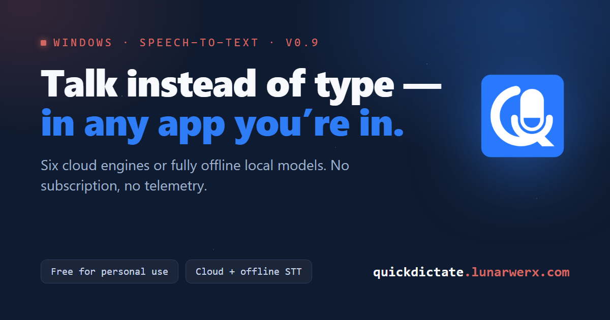

# quickdictate.github.io

The website for **QuickDictate**, a tiny Windows tray app that turns your voice into
text anywhere you can type. This repo is just the marketing site. The app itself, with
the source and releases, lives in its own repo.

- **Live site:** https://quickdictate.github.io/
- **The app:** https://github.com/LunarWerxs/QuickDictate
- **Made by:** [LunarWerx Studios](https://lunarwerx.com)



## What this is

One hand-written `index.html` and a folder of images. No framework, no build step, no
dependencies, and nothing pulled from a CDN, so the page works offline and loads
instantly. GitHub Pages serves it straight from the `main` branch.

If you're looking to *use* QuickDictate rather than hack on its website, head to the
[app repo](https://github.com/LunarWerxs/QuickDictate) instead.

## Layout

```
.
├── index.html        # the whole landing page (HTML + inline CSS/JS)
├── 404.html          # themed not-found page
├── favicon.ico       # multi-size tab icon
├── .nojekyll         # tells GitHub Pages to serve files as-is (no Jekyll)
├── assets/           # app icon, logos, Settings screenshots, share card
├── tools/
│   └── og-card.html  # source for the share image (assets/og-image.png)
├── CHANGELOG.md
├── LICENSE
└── README.md
```

## Editing it

Everything visual is in `index.html` (the CSS and the little copy-button script are
inlined). Change the text or styles there and you're done.

To preview locally, serve the folder over HTTP so the relative image paths resolve:

```sh
python -m http.server 8000
# then open http://localhost:8000
```

Opening `index.html` straight off disk with `file://` mostly works too, but a local
server matches how GitHub Pages actually serves it.

## Deploying

Push to `main`. GitHub Pages rebuilds and the change is live at
[quickdictate.github.io](https://quickdictate.github.io/) within a minute or so.
There's no pipeline to babysit.

## The share image

`assets/og-image.png` is the 1200×630 card that shows up when someone drops a link to
the site in Slack, Discord, X, and friends. It's rendered from
[`tools/og-card.html`](tools/og-card.html). If you tweak the card, regenerate the PNG
by screenshotting that file at 1200×630 with any headless Chromium (Chrome or Edge),
run from the repo root:

```sh
chrome --headless --screenshot=assets/og-image.png \
  --window-size=1200,630 --hide-scrollbars tools/og-card.html
```

On Windows, point at the full `chrome.exe` (or `msedge.exe`) path. After you push,
social platforms cache previews, so run the URL through
[X's Card Validator](https://cards-dev.twitter.com/validator) or
[Facebook's Sharing Debugger](https://developers.facebook.com/tools/debug/) to force a
re-crawl.

## License

MIT. See [LICENSE](LICENSE).
